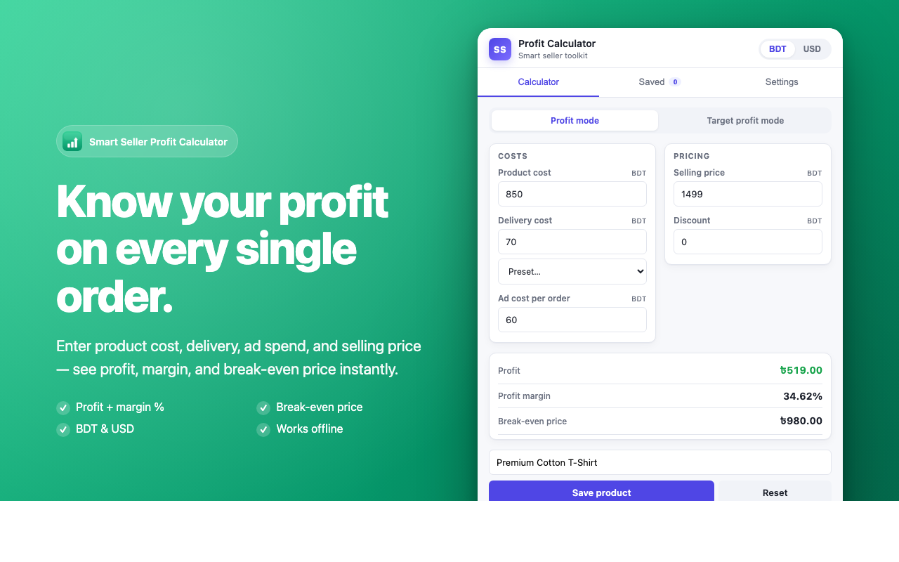
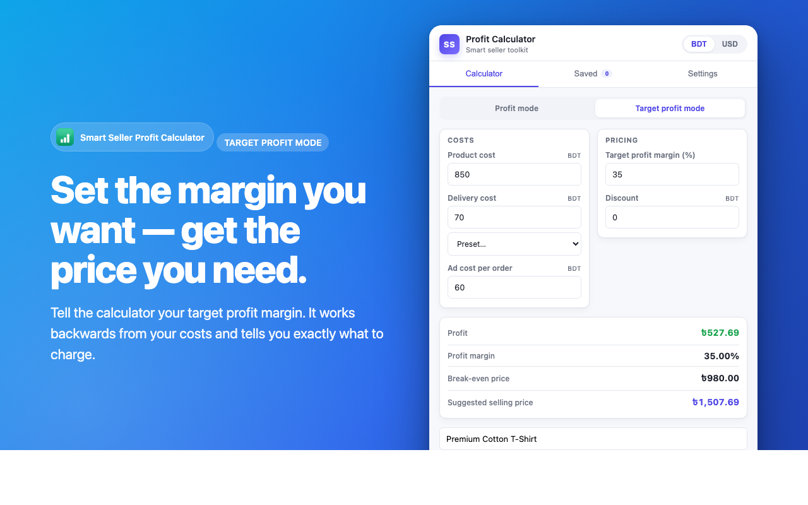
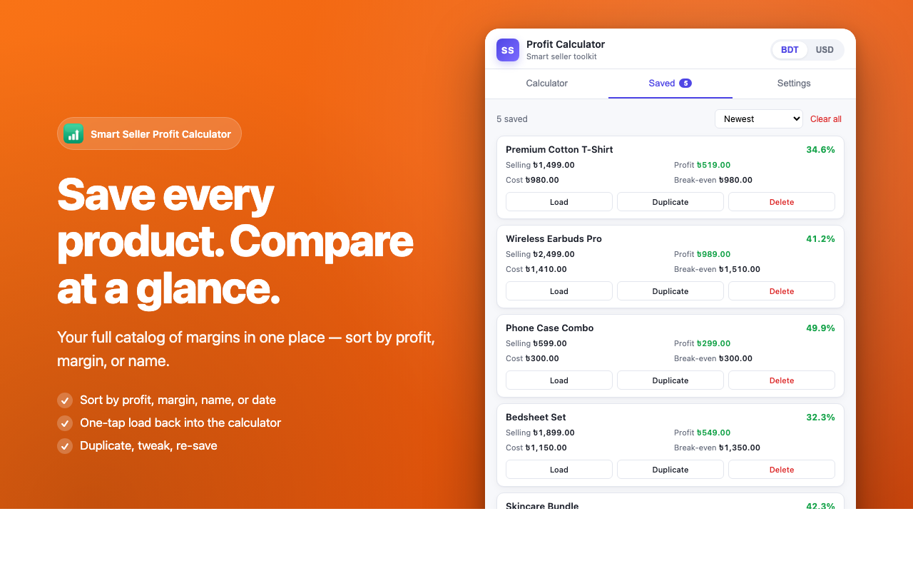
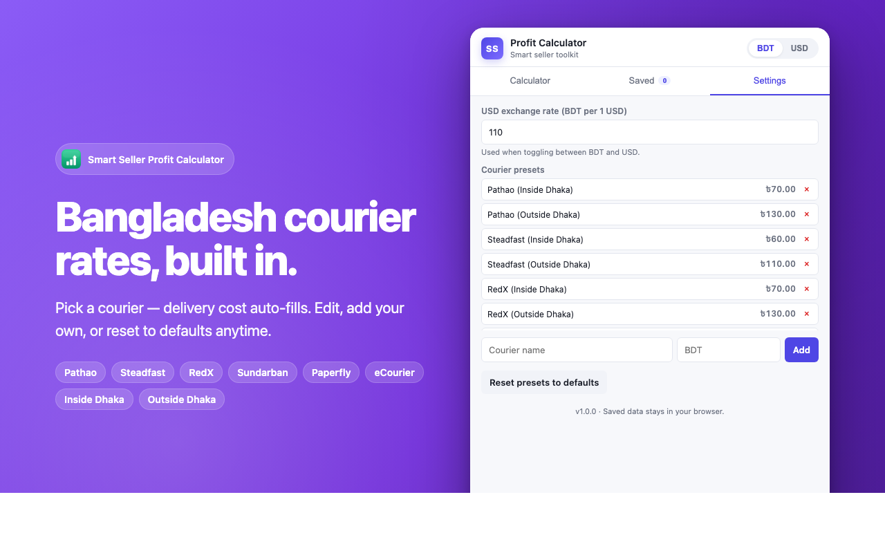

# Smart Seller Profit Calculator

> **Coming soon to the Chrome Web Store** — currently pending review.
> ⭐ Star this repo to be notified when it goes live.

<p align="center">
  
</p>

<p align="center">
  <strong>Calculate profit, margin & break-even for every order — in seconds.</strong>
</p>

<p align="center">
  Built for online sellers, with Bangladesh courier rates baked in (Pathao, Steadfast, RedX, Sundarban, Paperfly, eCourier).
</p>

<p align="center">
  
</p>

---

## Status

|                      |                               |
| -------------------- | ----------------------------- |
| **Chrome Web Store** | 🟡 Submitted — pending review |
| **Version**          | 1.0.0                         |
| **Manifest**         | V3                            |
| **License**          | MIT                           |

You can use it right now via [load-unpacked install](#load-unpacked-development) — see below.

---

## Features

**Core calculator**

- Inputs: product cost, delivery cost, ad cost, discount, selling price
- Outputs: profit, profit margin %, break-even price
- Color-coded result (green = profit, red = loss)

**Target Profit Mode**

- Enter a desired profit margin (e.g. 30%) and the extension reverse-calculates the selling price you need.

**Saved products**

- Save any calculation with a name
- Sort by newest, highest profit, highest margin, or name
- Load a saved product back into the calculator, duplicate it, or delete

**Currency toggle**

- BDT (৳) ↔ USD ($)
- Configurable USD exchange rate
- All values stored canonically in BDT, so toggling never loses precision

**Bangladesh courier presets**

- 12 built-in presets: Pathao, Steadfast, RedX, Sundarban, Paperfly, eCourier — each with Inside/Outside Dhaka pricing
- Add, edit, or remove your own
- Reset to defaults at any time

## Screenshots

<table>
  <tr>
    <td></td>
    <td></td>
  </tr>
  <tr>
    <td></td>
    <td></td>
  </tr>
</table>

## Install

### From the Chrome Web Store

_Coming soon — link will appear here once approved._

### Load unpacked (development)

1. **Clone** this repo or download as ZIP
2. Open `chrome://extensions` in Chrome
3. Toggle **Developer mode** on (top right)
4. Click **Load unpacked** and select the project folder
5. Pin the extension to your toolbar from the puzzle-piece menu

## Project layout

```
.
├── manifest.json           # MV3 manifest
├── popup.html              # Popup UI structure
├── popup.css               # Styles
├── popup.js                # All logic (calculation, storage, UI)
├── icons/                  # 16/32/48/128 px PNGs + 1024 master
├── store-assets/           # Web Store screenshots, promo tile, listing copy
└── scripts/
    ├── generate-icons.py        # Regenerate icons (Python + Pillow)
    ├── generate-promo-tile.py   # Regenerate the 440×280 promo tile
    ├── generate-screenshots.sh  # Render the 4 store screenshots
    └── build.sh                 # Package the extension into a zip
```

## Development

No build step. Edit the files directly, then click the reload icon for the extension on `chrome://extensions` to see changes.

### Regenerate icons / promo tile

Requires Python 3 with [Pillow](https://pillow.readthedocs.io/):

```bash
pip3 install Pillow      # if not already installed
python3 scripts/generate-icons.py
python3 scripts/generate-promo-tile.py
```

### Regenerate screenshots

Requires Google Chrome installed locally (uses headless mode):

```bash
bash scripts/generate-screenshots.sh
```

### Build for the Chrome Web Store

```bash
bash scripts/build.sh
```

Produces `smart-seller-profit-calculator.zip` in the project root, ready to upload at the [Chrome Web Store Developer Dashboard](https://chrome.google.com/webstore/devconsole/).

## Privacy

All data (saved products, settings, courier presets) is stored **locally in your browser** using `chrome.storage.local`. Nothing is transmitted anywhere. No analytics, no tracking, no ads. The extension requests only the `storage` permission.

See the full [Privacy Policy](https://shajidhassan.github.io/Smart-Seller-Profit-Calculator/privacy.html) for details.

## Contributing

Issues and pull requests welcome at [github.com/ShajidHassan/Smart-Seller-Profit-Calculator/issues](https://github.com/ShajidHassan/Smart-Seller-Profit-Calculator/issues).

## License

MIT © Shajid Hassan
